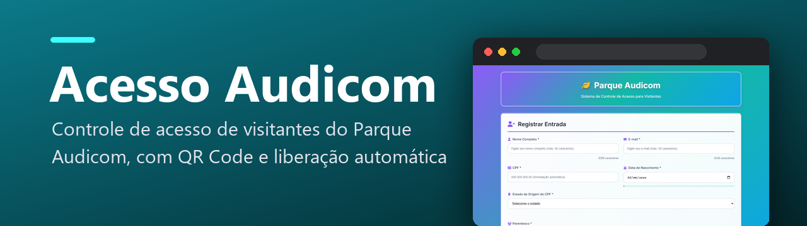
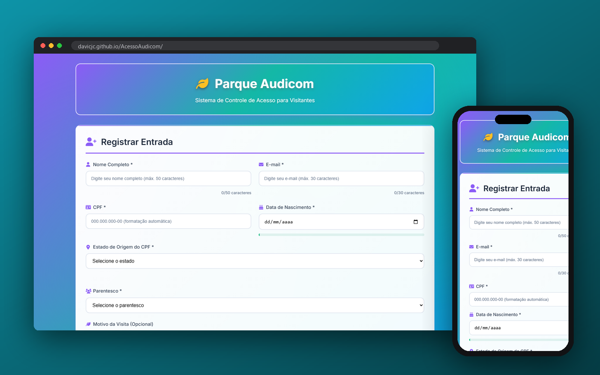
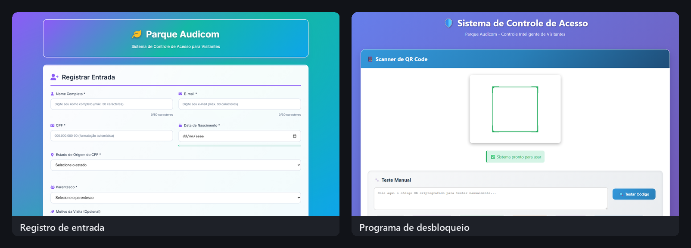

<p align="center">
  
</p>

<p align="center">
  
  <a href="https://davicjc.github.io/AcessoAudicom/"></a>
  
  
  
  
  
  
</p>

<p align="center">Controle de acesso de visitantes do Parque Audicom: cadastro web com QR Code, receptor Java e Raspberry Pi Pico liberando a catraca.</p>


<p align="center">
  
</p>

### 📸 Telas do sistema

<p align="center">
  
</p>

---

Uma aplicação web moderna e elegante para controle de acesso de visitantes, desenvolvida com HTML5, CSS3 e JavaScript puro.

## ✨ Características

### 📝 Formulário de Registro
- **Nome Completo** - Campo obrigatório
- **E-mail** - Campo obrigatório com validação
- **CPF** - Campo obrigatório com máscara e validação
- **Idade** - Campo obrigatório (1-120 anos)
- **Motivo da Visita** - Campo opcional com opções pré-definidas

### 🎨 Design Moderno
- Interface responsiva e elegante
- Gradientes e efeitos visuais modernos
- Animações suaves e transições
- Ícones Font Awesome para melhor UX
- Design mobile-first

### 🔧 Funcionalidades
- ✅ Validação em tempo real dos campos
- ✅ Validação completa de CPF
- ✅ Prevenção de CPFs duplicados
- ✅ Armazenamento local (localStorage)
- ✅ Busca em tempo real
- ✅ Exportação para CSV
- ✅ Exclusão de registros com confirmação
- ✅ Notificações de sucesso/erro
- ✅ Responsivo para mobile e desktop

## 📁 Estrutura do Projeto

```
Acesso_Audicom/
├── index.html      # Página principal
├── styles.css      # Estilos CSS
├── script.js       # Funcionalidades JavaScript
└── README.md       # Documentação
```

## 🛠️ Tecnologias Utilizadas

- **HTML5** - Estrutura semântica
- **CSS3** - Estilos modernos com Flexbox/Grid
- **JavaScript ES6+** - Funcionalidades interativas
- **Font Awesome** - Ícones
- **Google Fonts** - Tipografia (Inter)

## 📊 Funcionalidades Detalhadas

### Validação de Dados
- Validação de formato de e-mail
- Validação matemática completa de CPF
- Verificação de campos obrigatórios
- Prevenção de registros duplicados

### Gerenciamento de Dados
- Armazenamento local no navegador
- Exportação dos dados em formato CSV
- Busca por nome, e-mail ou CPF
- Exclusão individual de registros

### Interface do Usuário
- Notificações visuais para ações
- Modal de confirmação para exclusões
- Estados vazios informativos
- Animações de entrada suaves

## 🎯 Recursos Avançados

### Atalhos de Teclado
- `Ctrl + K` - Focar no campo de busca
- `Escape` - Limpar busca atual

### Responsividade
- Layout adaptável para diferentes tamanhos de tela
- Navegação otimizada para dispositivos móveis
- Tabela com scroll horizontal em telas pequenas

## 🔒 Privacidade e Segurança

- Todos os dados são armazenados localmente no navegador
- Nenhuma informação é enviada para servidores externos
- Validação rigorosa de CPF para evitar dados inválidos

## 🎨 Personalização

O sistema usa variáveis CSS para fácil personalização de cores e estilos:

```css
:root {
    --primary-color: #2563eb;
    --success-color: #059669;
    --danger-color: #dc2626;
    /* ... outras variáveis */
}
```

## 📱 Compatibilidade

- ✅ Chrome 80+
- ✅ Firefox 75+
- ✅ Safari 13+
- ✅ Edge 80+

## 🤝 Contribuição

1. Faça um fork do projeto
2. Crie uma branch para sua feature (`git checkout -b feature/AmazingFeature`)
3. Commit suas mudanças (`git commit -m 'Add some AmazingFeature'`)
4. Push para a branch (`git push origin feature/AmazingFeature`)
5. Abra um Pull Request

## 📄 Licença

Este projeto está sob a licença MIT. Veja o arquivo `LICENSE` para mais detalhes.

## 👥 Autor

Desenvolvido com ❤️ para a Audicom

---

**💡 Dica:** Para usar em produção, considere implementar um backend para persistência de dados mais robusta e sincronização entre dispositivos.

---

<p align="center">Desenvolvido por <a href="https://github.com/Davicjc">Davi Castro</a> · <a href="https://davicjc.com">davicjc.com</a><br><sub>para Audicom Telecom</sub></p>
